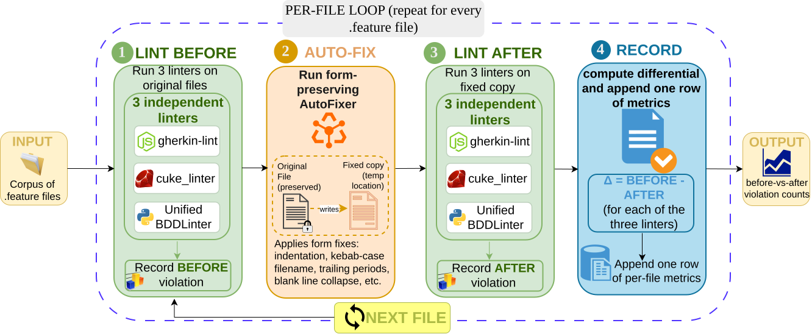
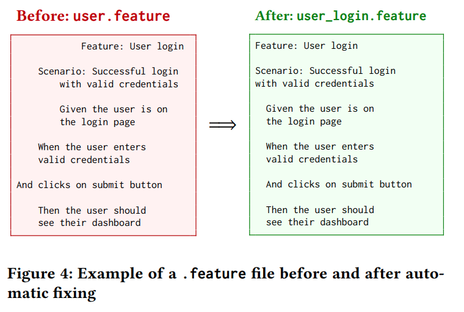
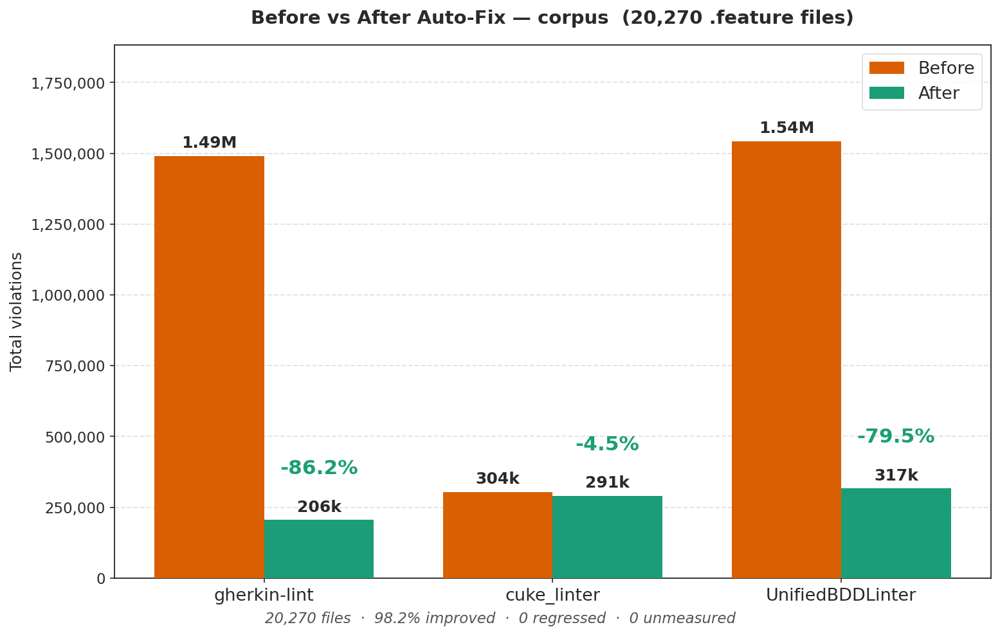
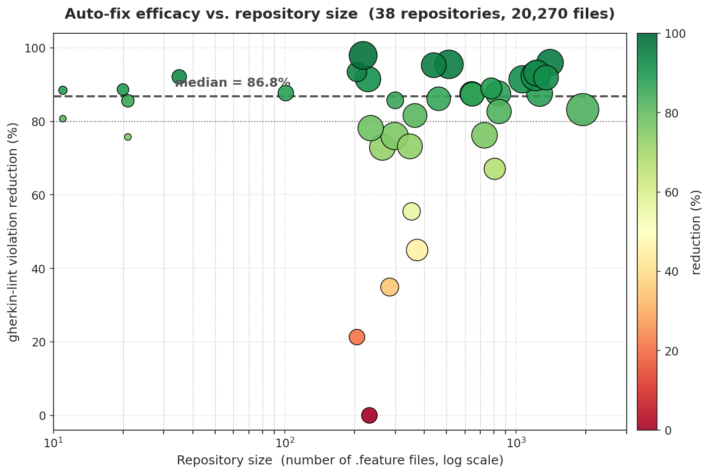

# UnifiedBDDLinter

**A linter and form-preserving auto-fixer for Gherkin `.feature` files.**

[](LICENSE)
[](https://github.com/vaishnavkoka/UnifiedBDDLinter/actions/workflows/ci.yml)
[](https://www.python.org/)

A Gherkin `.feature` file is two things at once: a requirement a business
stakeholder reads, and an executable test a runtime binds step definitions to.
Its quality is usually policed by a handful of separate linters that check
disjoint concerns, disagree with each other, and only ever report problems.

UnifiedBDDLinter brings style, structure, workflow and business-readability
checks under a single engine, and adds an auto-fixer that repairs what can be
repaired mechanically while refusing to touch anything that would change what a
test means.



---

## Quick start

No installation. Python 3.8 or later, standard library only.

```bash
git clone https://github.com/vaishnavkoka/UnifiedBDDLinter.git
cd UnifiedBDDLinter

python3 linter.py examples/                     # report
python3 auto_fix.py examples/ -o fixed/         # repair, into a new directory
python3 tests/run_tests.py                      # 78 tests
```

There is no `pip install` step and no `requirements.txt` at the root. The
package has no third-party imports, and a test in the suite fails if one is
introduced.

---

## What it checks

28 rules across four families. **8 are repaired automatically, 20 are reported
for a human to resolve.**

| Family | Rules | Repaired | Checks |
|---|--:|--:|---|
| **Style** | 7 | 5 | indentation, trailing whitespace, blank lines, final newline, filename format, name length, tag alignment |
| **Structure** | 8 | 3 | feature and scenario names, empty files, duplicate scenario names, filename/feature agreement, byte-order marks, duplicate tags |
| **Workflow** | 6 | 0 | Given/When/Then order, a single `When`, presence of an action and a verification step, step count |
| **Quality** | 7 | 0 | implementation-detail leakage, vague language, test jargon, mock data, near-duplicate scenarios |

The **Quality** family is what no other Gherkin linter provides: it asks whether
a specification reads as a requirement or as a script. The full catalogue, and
exactly how each quality rule decides, is in [docs/RULES.md](docs/RULES.md).

---

## The safe-fix boundary

The central design decision is which violations may be repaired automatically.
Our rule:

> A repair may alter **neither the words in the specification nor any string the
> runtime binds a step definition to.**

The second clause is stronger than it first appears, and one rule was withdrawn
because of it. `W005` removes a step's trailing full stop. That invents no text,
so it satisfies word preservation — and it is still unsafe, because step text is
precisely the string Cucumber matches a step definition against. On a minimal
Maven project, applying it turned a passing suite into a failing one with the
step reported `UNDEFINED`. `W005` is now detect-only.

Rules land in "reported" for three different reasons:

- repairing would require **authoring text** (`ST001`–`ST004`, most of `W*`, all of `Q*`)
- repairing would **change a string the runtime binds on** (`W005`)
- **no single correct repair exists** (`S006`, where shortening a name means choosing which words to drop)

---

## Example repair



The fixer normalises indentation, spacing and blank lines, and derives the
filename from the `Feature:` line. The scenario content is untouched — not
"mostly untouched", but verifiably identical, as the next section describes.

---

## Results

Evaluated on **20,270 `.feature` files from 38 public repositories**.



| Linter | Before | After | Change |
|---|--:|--:|--:|
| `gherkin-lint` | 1,490,636 | 205,971 | **−86.2%** |
| UnifiedBDDLinter | 1,542,605 | 316,828 | **−79.5%** |
| `cuke_linter` | 304,064 | 290,520 | −4.5% |

**19,910 files (98.2%) improved. 338 were unchanged. No file regressed.**
The median repository saw an 86.8% reduction, and 26 of 38 exceeded 80%.

`cuke_linter` moves least by design — its rules largely target the semantic
concerns the fixer deliberately declines to touch, and the filename conflict
below accounts for much of the rest.



The per-repository breakdown for all 38 is in
[results/table1_repositories.csv](results/table1_repositories.csv).

### Repairs are verified, not asserted

A drop in reported violations only shows that the linters are satisfied. So every
repaired file is re-parsed with the official Gherkin parser and compared with its
original on the fields the runtime uses — feature name, tags, background steps,
scenario names, step text.

| | |
|---|--:|
| files with a **content edit** | **0** |
| files the parser can process | 19,492 |
| of those, **identical model** after repair | **19,491 (99.99%)** |
| parse regressions | 1 |

Layout is absent from that comparison by construction: the parser does not expose
indentation or blank lines, so a form-preserving repair is invisible to it while
any change to what the specification asserts is not.

---

## The two incumbent linters are mutually unsatisfiable

`gherkin-lint` requires kebab-case filenames. `cuke_linter` requires snake_case.
No filename satisfies both. We demonstrate this directly by running the fixer
over the same 20,270 files under each convention, changing nothing else:

| Fixer configured to | `gherkin-lint` `file-name` | `cuke_linter` `FeatureFileWithInvalidName` |
|---|--:|--:|
| **kebab-case** | 14,829 → 2,529 (**−12,300**) | 7,347 → 19,034 (**+11,687**) |
| **snake_case** | 14,829 → 18,697 (**+3,868**) | 7,347 → 1,789 (**−5,558**) |

Satisfying one necessarily violates the other. The conflict is invisible to
either linter in isolation and appears only when both are run over the same
before/after pair. The tool ships snake_case by default, configurable via
`formatting.file_name_style` in `.unified-lintrc.json`.

---

## Usage

### Lint

```bash
python3 linter.py features/                   # all four families, 28 rules
python3 cli.py features/ --format json        # the subset external linters corroborate
python3 linter.py features/ --severity error --summary
```

`linter.py` runs everything. `cli.py` runs the style/structure/workflow subset
and is the entry point the evaluation drives, so it is the one to use when
reproducing the reported numbers.

### Fix

```bash
python3 auto_fix.py features/ -o fixed/
python3 auto_fix.py features/ --dry-run
```

The fixer always writes to a new directory and never modifies its input.

### Configure

Copy a template to your project root as `.unified-lintrc.json`:

```bash
cp config/unified-lintrc.default.json .unified-lintrc.json
```

It controls rule severities, per-rule enable/disable, numeric thresholds, the
filename convention and path exclusions. The file is discovered by walking
upward from the target, so one file at a repository root governs everything
beneath it. `python3 bddlint.py config` prints what actually resolved.

---

## Reproducing the evaluation

The differential lint–fix–lint study is run by a **separate harness** in
[evaluation/](evaluation/). Because it measures our fixer *against* two
independent linters, both must be on the `PATH`. They are oracles for the
experiment, **not dependencies of the tool** — nothing above this section
invokes them.

```bash
npm install -g gherkin-lint          # Node.js oracle
gem install cuke_linter              # Ruby oracle
pip install -r evaluation/requirements.txt

python3 evaluation/phase3_bdd_pipeline_full.py -r <repos-dir> -o out/
```

`-o` is a parent directory. Each run creates its own timestamped subdirectory, so
repeated runs never overwrite one another, and the harness generates its figures
and tables itself. Add `--no-oracles` to measure our tool alone, requiring
neither Node nor Ruby.

A results file for the full corpus is around 700 MB, which no editor will open.
[demo/inspect_run.py](demo/inspect_run.py) browses one without loading it.

---

## Limitations

**English keywords only.** The linter is a line-based scan that recognises only
English Gherkin keywords. On this corpus 380 files (1.9%) declare a non-English
language header, predominantly Dutch, and are reported as lacking a feature
declaration although the official parser reads them correctly. The affected rule
is detect-only, so these files are never modified, but their violation counts are
overstated.

**Files that never parse.** 778 files cannot be parsed before or after repair,
and are excluded from the semantic verification rather than counted as verified.
232 of them come from a single repository whose files share the `.feature`
extension while containing protein contact-map data. We retain it, since
excluding an input after observing its result would bias the evaluation.

**Heuristic quality checks.** The business-readability rules are keyword and
shape heuristics rather than linguistic analysis. That choice keeps the tool
dependency-free and bounds the subtlety of what they can detect. Each rule's
actual mechanism is documented in [docs/RULES.md](docs/RULES.md).

**Corpus currency.** These results come from repositories cloned on
**19 May 2026**. Public repositories change, so re-running against today's
versions will not reproduce these figures exactly. The SHA-256 manifest in
[corpus/MANIFEST.csv](corpus/MANIFEST.csv) identifies precisely which file
contents were measured.

---

## Data availability

The complete per-file measurements, the repaired corpus, and the second run used
for the filename-conflict comparison are archived on Zenodo:

> **Dataset (Zenodo):** [TBD]
>
> **Video demonstration:** [TBD]

This repository carries the headline figures, the per-repository table, a sample
of the per-file rows, and the corpus manifest. Column meanings are documented in
[results/README.md](results/README.md).

---

## Repository layout

```
UnifiedBDDLinter/
├── linter.py              full four-family linter (28 rules)
├── cli.py                 style/structure/workflow subset
├── auto_fix.py            form-preserving auto-fixer
├── bddlint.py             unified CLI (lint / fix / rules / config)
├── src/unifiedbddlinter/  parser, rule engine, fixer, catalogue, config
├── tests/                 78 tests, no dependencies
├── examples/              sample .feature files and a walkthrough
├── config/                .unified-lintrc.json templates
├── evaluation/            differential harness, analysis, semantic verification
├── demo/                  demo script and inspection tools
├── results/               figures, tables and summary measurements
├── corpus/                SHA-256 manifest and materialiser
└── docs/                  rule reference, design, evaluation, FAQ
```

---

## Documentation

- [docs/RULES.md](docs/RULES.md) — all 28 rules, and how each quality rule decides
- [docs/DESIGN.md](docs/DESIGN.md) — architecture and the safe-fix boundary
- [docs/EVALUATION.md](docs/EVALUATION.md) — corpus construction, method, per-repository results
- [docs/FAQ.md](docs/FAQ.md) — questions the numbers invite
- [demo/DEMO.md](demo/DEMO.md) — the demonstration script, command by command

---

## Citation

See [CITATION.cff](CITATION.cff).

## License

MIT. See [LICENSE](LICENSE).
